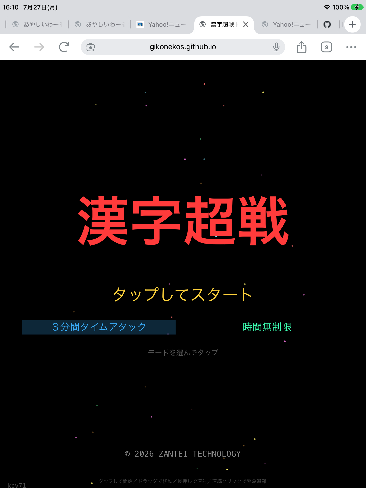
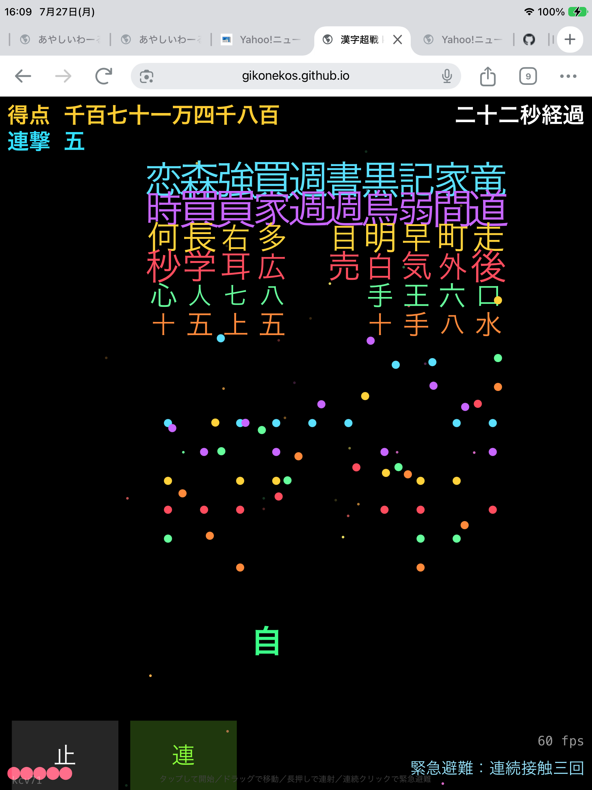
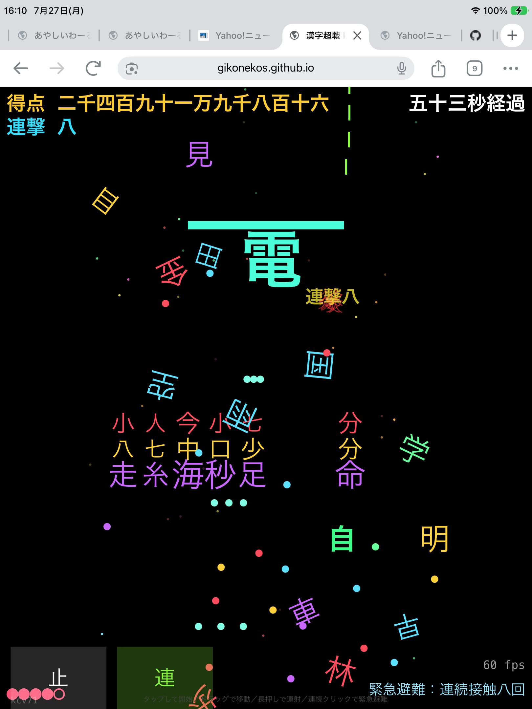

# 漢字超戦（かんじちょうせん）Kanji Hyper War.

文字・UTF-8記号のみ（画像・絵文字不使用）のブラウザ向けシューティングゲーム。HTML5/Canvas実装。

グローバルランキング用に hashes.txt.gz を必要とする。

▶ [motoikenkichi.com](https://motoikenkichi.com/) からゲームプレイでプレイ可能

▶[gikonekos.github.io](https://gikonekos.github.io/kanji-hyper-war/kc.html)からもプレイ可能。

## ライセンス
スクリプト　MIT License（[LICENSE](LICENSE)参照）

音楽　(Dash! / VEZAR) © 1994-2026 MOTOI Kenichi. All Rights Reserved.

## ドキュメント
開発経緯は [doc/changelog.md](doc/changelog.md) を参照

## 関連

- 作者サイト: [motoikenkichi.com](https://motoikenkichi.com/)
- BGMの一部は PLAY3 由来の曲（Dash! / VEZAR）— [PLAY3 Archive](https://github.com/gikonekos/PLAY3-Archive)
- 他プロジェクト: [github.com/gikonekos](https://github.com/gikonekos)
